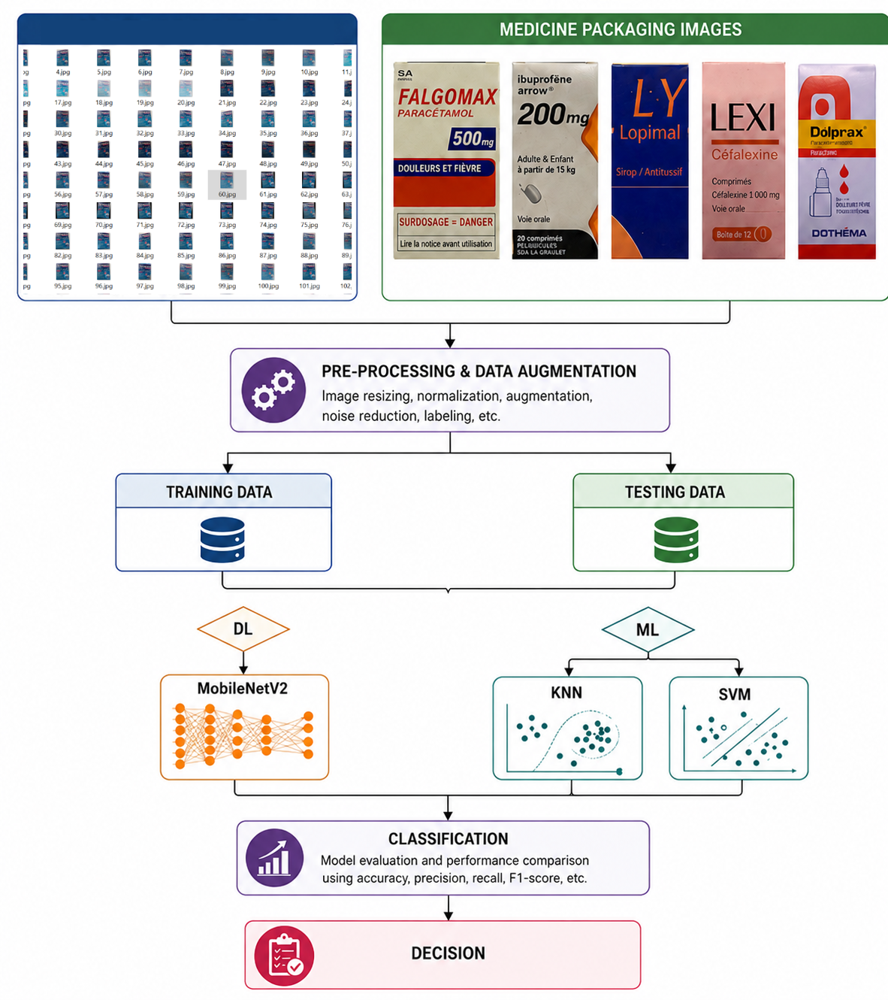

# Enhancing Medicine Identification with AI: A Comparison of MobileNetV2, SVM, and KNN for Image-Based Classification

## Description

This repository contains the implementation used in the study **“Enhancing Medicine Identification with AI: A Comparison of MobileNetV2, SVM, and KNN for Image-Based Classification.”**

The project investigates image-based medicine package classification using three artificial intelligence models:

- **MobileNetV2** with transfer learning and fine-tuning
- **Support Vector Machine (SVM)** with handcrafted image features
- **K-Nearest Neighbors (KNN)** with handcrafted image features

The objective is to compare traditional machine learning methods and a deep learning model for classifying medicine images and supporting medicine identification in a smart healthcare application.


## Dataset Information

The dataset used in this study is a self-curated medicine image dataset captured using mobile phone cameras.

Dataset characteristics:

- Image type: medicine package images
- Image format: JPG
- Number of medicine classes: 50
- Original images per medicine: 10 images captured from different angles
- Augmented images per medicine: 140 images
- Total number of images: 7,000
- Training split: 80%
- Testing/validation split: 20%
- Training images per class: 112
- Testing images per class: 28

The dataset was created by capturing images of medicine packages under realistic conditions and then applying data augmentation techniques to increase the number and diversity of samples.

Data augmentation included:

- Rotation
- Scaling
- Translation
- Brightness adjustment
- Horizontal flipping
- Zooming
- Cropping
- Contrast adjustment

## Dataset Availability

The self-curated medicine image dataset used in this study is available on Figshare:

[Medicine Dataset 2024 - Figshare](https://figshare.com/s/1ffc918e9fdd8c9872ba)

The dataset contains JPG images of medicine packages organized into 50 classes. The images were captured using mobile phone cameras and augmented to obtain 7,000 images.

## Code Information

The repository includes two main implementation notebooks:

### 1. `MobilenetNetV2.ipynb`

This notebook contains the deep learning implementation using MobileNetV2.

Main steps:

- Load JPG medicine images
- Resize images to `224 × 224 × 3`
- Apply MobileNetV2 preprocessing
- Apply data augmentation
- Train MobileNetV2 using transfer learning
- Fine-tune the last layers of the network
- Evaluate classification performance
- Generate accuracy and loss curves
- Generate confusion matrix
- Apply Grad-CAM visualization for model interpretability

MobileNetV2 settings:

- Input size: `224 × 224 × 3`
- Optimizer: Adam
- Initial learning rate: `1 × 10^-3`
- Fine-tuning learning rate: `1 × 10^-5`
- Loss function: categorical cross-entropy
- Batch size: 32
- Fine-tuned layers: last 40 layers
- Callbacks: EarlyStopping, ModelCheckpoint, ReduceLROnPlateau

### 2. `KNN+SVM.ipynb`

This notebook contains the traditional machine learning implementation using KNN and SVM.

Main steps:

- Load JPG medicine images
- Convert images to grayscale
- Resize images to `128 × 128`
- Apply Difference of Gaussians (DoG)
- Apply Gabor filters for texture feature extraction
- Extract statistical features
- Reduce dimensionality using LDA or PCA
- Train KNN classifier
- Train SVM classifier
- Evaluate model performance
- Generate classification reports and confusion matrices

KNN settings:

- Input size: `128 × 128`
- Feature extraction: DoG and Gabor filters
- Dimensionality reduction: LDA
- Distance metric: Euclidean distance
- Tested k values: 1 to 10

SVM settings:

- Kernel: Radial Basis Function (RBF)
- Regularization parameter: `C = 10`
- Gamma: `scale`
- Dimensionality reduction: PCA with 50 principal components
- Feature extraction: multi-scale and multi-directional Gabor filters
- Statistical features: mean and standard deviation

## Requirements

The code was implemented using Python. The following packages are required:

```bash
python >= 3.8
numpy
pandas
matplotlib
seaborn
opencv-python
scikit-image
scikit-learn
tensorflow
keras
pillow
```

Install the required packages using:

```bash
pip install numpy pandas matplotlib seaborn opencv-python scikit-image scikit-learn tensorflow keras pillow
```

## Usage Instructions
### 2. Install dependencies

```bash
pip install -r requirements.txt
```

If a `requirements.txt` file is not available, install the packages listed in the Requirements section manually.

### 3. Prepare the dataset

Organize the dataset in class-based folders:

```text
dataset/
│
├── AMOXICILLIN/
│   ├── image_001.jpg
│   ├── image_002.jpg
│   └── ...
│
├── DAFALGAN/
│   ├── image_001.jpg
│   ├── image_002.jpg
│   └── ...
│
└── ...
```

Each folder should represent one medicine class.

### 4. Run MobileNetV2 model

Open and run:

```text
MobilenetNetV2.ipynb
```

This notebook trains and evaluates the MobileNetV2 model using transfer learning and fine-tuning.

### 5. Run KNN and SVM models

Open and run:

```text
KNN+SVM.ipynb
```

This notebook extracts handcrafted features and evaluates KNN and SVM classifiers.

## Methodology

The proposed methodology consists of the following stages:

1. Collect medicine package images using mobile phone cameras.
2. Capture multiple images for each medicine from different angles.
3. Apply data augmentation to increase dataset size and improve model robustness.
4. Preprocess images by resizing, normalization, and grayscale conversion when required.
5. Train and evaluate traditional machine learning classifiers:
   - KNN
   - SVM
6. Train and evaluate MobileNetV2 using transfer learning.
7. Fine-tune MobileNetV2 to adapt the model to medicine package features.
8. Evaluate models using standard classification metrics.
9. Compare the performance of MobileNetV2, SVM, and KNN.

## Evaluation Metrics

The models were evaluated using:

- Accuracy
- Precision
- Recall
- F1-score
- Confusion matrix

## Experimental Results

The main classification results reported in the study are:

| Model | Accuracy |
|---|---:|
| KNN | 97.0% |
| SVM | 99.4% |
| MobileNetV2 | 100% |

MobileNetV2 achieved the highest classification accuracy, followed by SVM and KNN.

## Grad-CAM Visualization

Grad-CAM was used to interpret the MobileNetV2 predictions. The heatmaps showed that the model focused on meaningful medicine package regions, including:

- Medicine name
- Dosage information
- Label design
- Packaging color and visual patterns


## Citation

If you use this code or dataset description, please cite the related article:

```text
Lati, A., Hacini, I., Zitouni, F., Othman, K. M., Noorwali, A., Almaktoom, A. T., and Mohamed, A. W.
"Enhancing Medicine Identification with AI: A Comparison of MobileNetV2, SVM, and KNN for Image-Based Classification."
2026.
```

## License

This project is provided for academic and research purposes.

Before publicly releasing the dataset, ensure that all images are allowed to be shared and that no private or restricted information is included.

## Contact

For questions about the code or dataset, please contact the corresponding author or the project maintainers.
